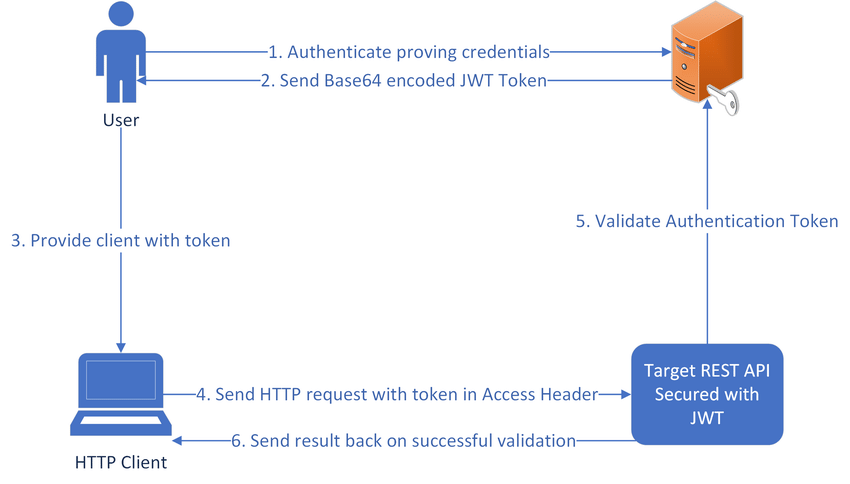

# Lottery Management System

A full-stack web application for managing lottery ticket sales, claims, and shop operations.

## Features

- Multi-role system (Admin, Shop Owner, Customer)
- Ticket purchase and claiming system
- Shop management and allocation
- Real-time reporting and analytics
- Secure authentication and authorization

## Tech Stack

### Frontend
- React.js with Vite
- Tailwind CSS for styling
- Shadcn UI components
- Zustand for state management
- Axios for API calls
- React Router for navigation

### Backend
- Node.js with Express
- MongoDB with Mongoose
- JWT for authentication
- bcrypt for password hashing

## Live Demo
Visit the live application: [Lottery-POS](https://lottery-pos.vercel.app)

### Demo Credentials

#### Admin Access
```
Email: admin1@gmail.com
Password: Admin@1
```

#### Shop Owner Access
```
Email: shopowner1@gmail.com
Password: shopOwner@1
```

#### Customer Access
```
Email: customer1@gmail.com
Password: customer@1
```

## Prerequisites

- Node.js (v14 or higher)
- MongoDB
- npm or yarn

## Environment Variables

### Frontend (.env)
```env
VITE_API_URL=http://localhost:4000
```

### Backend (.env)
```env
PORT=4000
MONGODB_URI=your_mongodb_connection_string
JWT_SECRET=your_jwt_secret_key
NODE_ENV=development
```

## Installation

1. Clone the repository
```bash
git clone https://github.com/Prince-Singh-05/Lottery_POS
cd Lottery_POS
```

2. Install dependencies for both frontend and backend
```bash
# Install backend dependencies
cd server
npm install

# Install frontend dependencies
cd ../client
npm install
```

3. Set up environment variables
- Create `.env` files in both client and server directories
- Add the required environment variables as shown above

4. Start the development servers
```bash
# Start backend server
cd server
npm run dev

# Start frontend development server
cd ../client
npm run dev
```

## API Documentation

### Authentication Endpoints

#### POST /api/user/signup
Register a new user
```json
{
  "name": "string",
  "email": "string",
  "password": "string",
  "role": "customer|shop_owner|admin"
}
```

#### POST /api/user/login
Login user
```json
{
  "email": "string",
  "password": "string"
}
```

### Ticket Endpoints

#### GET /api/ticket
Get all tickets (requires authentication)

#### POST /api/ticket/buy
Buy a ticket
```json
{
  "ticketId": "string"
}
```

#### GET /api/ticket/claim/:ticketId
Claim a winning ticket

### Shop Endpoints

#### GET /api/shop
Get all shops

#### POST /api/shop/register
Register a new shop
```json
{
  "name": "string",
  "location": "string",
  "owner": "userId"
}
```

### Report Endpoints

#### GET /api/user/customerReport
Get customer's ticket summary and statistics

#### GET /api/ticket/weeklyReport
Get shop's weekly sales report (shop owner only)

## Screenshots & Diagrams

### System Architecture


### User Interfaces

#### Admin Dashboard

- Manage ticket types
- View sales reports
- User management

#### Shop Owner Dashboard

- Sell tickets
- View sales history
- Daily reports

#### Customer Dashboard

- Purchase tickets
- View ticket history
- Claim prizes

<!-- ### Database Schema -->
<!--  -->

### Authentication Flow


## Security Features

- JWT-based authentication
- Password hashing with bcrypt
- Protected routes with role-based access
- HTTP-only cookies for token storage
- CORS protection
- Input validation and sanitization

## Deployment

The application is deployed using:
- Frontend: Vercel
- Backend: Vercel
- Database: MongoDB Atlas

## Contributing

1. Fork the repository
2. Create your feature branch (`git checkout -b feature/AmazingFeature`)
3. Commit your changes (`git commit -m 'Add some AmazingFeature'`)
4. Push to the branch (`git push origin feature/AmazingFeature`)
5. Open a Pull Request

## License

This project is licensed under the MIT License - see the [LICENSE](LICENSE) file for details

## Contact

Prince Singh - princesingh100503@gmail.com
Project Link: [https://github.com/Prince-Singh-05/Lottery_POS](https://github.com/Prince-Singh-05/Lottery_POS)
